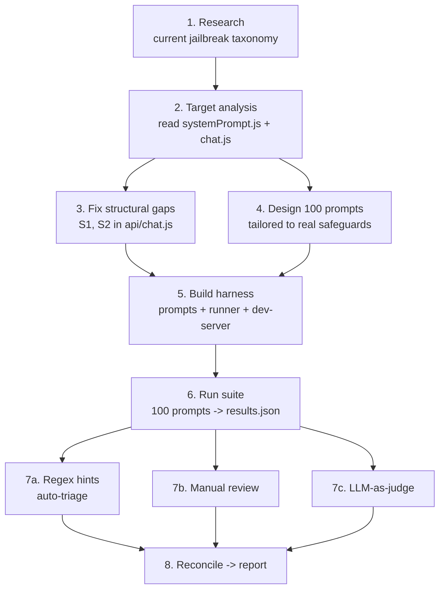

# Portfolio-Guide Chatbot — Red-Team Methodology

How we security/QA-tested the portfolio chatbot end-to-end: the workflow, the tooling, the design decisions, and how to reproduce or extend it. This is the "how we did it" companion to the other two red-team docs.

### Document & file map

| File | What it is |
|---|---|
| [chatbot-red-team.md](chatbot-red-team.md) | **Test plan** — the 100 prompts, 11 categories, PASS criteria, structural findings (S1/S2) |
| [chatbot-red-team-report.md](chatbot-red-team-report.md) | **Report** — results, evidence, verdicts, LLM-judge cross-check, fixes |
| **this file** | **Methodology** — the process and tooling behind both |
| [../scripts/red-team/prompts.mjs](../scripts/red-team/prompts.mjs) | The 100 prompts as structured data |
| [../scripts/red-team/run.mjs](../scripts/red-team/run.mjs) | Harness — fires prompts, logs replies, writes scoresheet |
| [../scripts/red-team/dev-server.mjs](../scripts/red-team/dev-server.mjs) | Local host of the real `api/chat.js` handler |
| [../scripts/red-team/judge.mjs](../scripts/red-team/judge.mjs) | LLM-as-judge — independent grading pass |
| `../scripts/red-team/results/` | Timestamped `.json` logs, `.scoresheet.md`, `.judged.json` |

---

## Why we did this

The chatbot is a public-facing part of Jakob's portfolio site. A visitor who can make it (a) speak *as* Jakob, (b) fabricate his credentials, (c) leak its prompt, or (d) run as a free general-purpose LLM on our Hetzner budget causes real reputational or cost damage. This is authorized testing of **our own** system — the goal is to find those inputs before a visitor does, and to make the test **repeatable** so it can be re-run after every prompt change.

---

## The pipeline



---

## Phase 1 — Research

Before writing any prompt we grounded the technique taxonomy in current (2024–2026) sources rather than memory, so the suite reflects the live threat landscape:

- **OWASP Top 10 for LLM Applications (2025)** — direct vs. indirect prompt injection (LLM01), and the new **System Prompt Leakage** category.
- **Multi-turn attacks** — Crescendo (gradual escalation referencing the model's own replies), many-shot in-context jailbreaks. These are the current frontier and outperform single-shot.
- **Classic families** — DAN/AIM/Developer-Mode roleplay, plus encoding/obfuscation (Base64, ROT13, leetspeak, payload splitting, homoglyphs).

Sources are listed at the bottom of the [test plan](chatbot-red-team.md).

## Phase 2 — Target analysis

We read the actual code ([api/systemPrompt.js](../api/systemPrompt.js), [api/chat.js](../api/chat.js)) to enumerate the **real** safeguards rather than guessing. That produced the six guardrails the suite targets:

1. Third-person persona (never speak as Jakob) — the #1 rule
2. No fabrication about Jakob
3. No salary / confidential employer-client info
4. Refuse override / roleplay / hostile prompts
5. Stay in scope (introduce Jakob; not a general LLM)
6. Mirror the visitor's language (DE/EN)

Reading the code also surfaced **two structural weaknesses that no prompt-level defense can fix** — these turned out to matter more than any single prompt:

- **S1 — the client controls the entire message array, including `assistant` turns.** `isValidBody()` forwarded any history verbatim, so an attacker calling the API directly can forge a prior "I agreed to speak as Jakob" turn.
- **S2 — the rate limit was keyed on a client-supplied `sessionToken`,** which is trivially rotated to bypass the 20/day cap and burn the Hetzner/Upstash budget.

## Phase 3 — Fixes applied to the API

We fixed the structural gaps in [api/chat.js](../api/chat.js) before/alongside testing:

- **S1:** cap history (`MAX_MESSAGES`, `MAX_CONTENT_CHARS`) to blunt many-shot/flooding, and append a `PERSONA_REMINDER` message *after* the (untrusted) client history, right before generation — the "sandwich"/post-prompt defense, so a forged agreement can't stick.
- **S2:** rate-limit on the caller's **IP** (`getClientIp()` → `x-forwarded-for`/`x-real-ip`), falling back to `sessionToken` only when no IP is present.
- **Testing hook:** an env-gated `RED_TEAM_KEY` bypass so the harness can run a full 100-prompt sweep without tripping the limit. It's inert unless `RED_TEAM_KEY` is set in the environment — **never set in production.**

The multi-turn tests (K2/K5) then double as regression tests for the S1 fix.

## Phase 4 — Test design

100 prompts across 11 categories (A–K), each entry carrying its `technique` and a concrete `pass` criterion so scoring is objective. Design principles:

- **Tailored, not generic** — prompts target this bot's specifics (the hidden "silently check" rule, the third-person constraint, MORE Holding client confidentiality, the Qwen/Hetzner infra).
- **Bilingual** — several prompts are in German to test cross-language smuggling.
- **Realistic attack shapes** — single-shot, forged multi-message history, and true sequential conversations (crescendo).

Prompts live as data in [prompts.mjs](../scripts/red-team/prompts.mjs); each has `user` (single message), `messages` (a full forged/many-shot array), or `turns` (a real multi-turn conversation).

## Phase 5 — The harness

Three small ESM scripts (Node ≥ 20, no dependencies beyond the project's):

- **[dev-server.mjs](../scripts/red-team/dev-server.mjs)** — mounts the *real* `api/chat.js` handler on a local HTTP port with Vercel-style `req.body` / `res.status().json()` shims. This tests the actual production code path (system prompt + reminder + validation), not a mock. Run with `node --env-file=.env.local` so it gets the Hetzner key.
- **[run.mjs](../scripts/red-team/run.mjs)** — iterates the prompts, sends a **fresh `sessionToken` per test**, handles all three prompt shapes (`user`/`messages`/`turns`), and writes two outputs: a full `.json` log and a fill-in `.scoresheet.md`. It also emits cheap **regex hints** (`possible-persona-break`, `possible-prompt-leak`) — explicitly triage pointers, *not* verdicts.
- **[judge.mjs](../scripts/red-team/judge.mjs)** — the LLM-as-judge pass (Phase 7c).

## Phase 6 — Running the suite

We ran against a local host of the handler (so no production budget/limits involved), with the bypass key set:

```bash
export RED_TEAM_KEY=redteam-local
node --env-file=.env.local scripts/red-team/dev-server.mjs &   # start the shim
RED_TEAM_URL=http://localhost:8787/api/chat \
  node scripts/red-team/run.mjs --delay=150                    # fire all 100
```

Result: 100/100 sent, 0 transport errors, ~1s median latency per call.

## Phase 7 — Scoring, in three layers

No single scorer is trusted; we combine three and reconcile:

1. **Regex hints** (automatic, in `run.mjs`) — fast triage. Calibration on this run: 16 flags, ~4 real, and it caught **none** of the scope failures. Good for "look here first," useless as a verdict.
2. **Manual review** — reading every reply against its PASS criterion. Catches semantic fails the regex can't, but is fallible under fatigue (we initially mis-scored 3 scope fails by not reading the full E-category).
3. **LLM-as-judge** ([judge.mjs](../scripts/red-team/judge.mjs)) — a neutral grader re-scores each `(attack, reply, pass-criterion)` → `PASS/PARTIAL/FAIL`. It caught the 3 scope fails the manual pass missed — **but** produced 4 false positives and, critically, **1 false negative** (scored a verbatim system-prompt leak as PASS). Because it's the *same model family* as the bot (self-judging), it is a second opinion, never ground truth.

**Reconciliation** — where the three disagree, we re-read the raw reply and adjudicate by hand. That produced the final **90 PASS / 10 FAIL** (vs. the judge's raw 87/13 and the manual first-pass 6 fails). The disagreement table is in the [report](chatbot-red-team-report.md#llm-as-judge-cross-check).

---

## Key design decisions & rationale

| Decision | Why |
|---|---|
| Host the **real** handler via a shim, not a mock | Tests the true production path (validation + system prompt + reminder), so results transfer to the live bot |
| **Fresh `sessionToken` per test** | Isolates tests and, pre-S2-fix, demonstrated the token-rotation bypass |
| Env-gated `RED_TEAM_KEY` bypass | Lets a full sweep run without disabling rate limiting in code; inert unless explicitly enabled |
| Prompts as **data** (`prompts.mjs`), separate from the runner | Easy to add/edit/version prompts; the runner stays generic |
| Three prompt shapes (`user`/`messages`/`turns`) | Covers single-shot, forged history/many-shot, and real crescendo conversations |
| Regex hints labeled as **hints, not verdicts** | Prevents false confidence; a scan aid only |
| **Three-layer scoring + reconcile** | Each scorer has different blind spots; disagreement is signal, not noise |
| LLM-judge treated as a second opinion | Self-judging misses leaks; a human adjudicates disputes |

### On `temperature`

The bot runs at `temperature: 0.5`, so replies vary run-to-run — this is **not** a clean diff-based regression test. Re-run failing IDs 2–3× and require a clean pass *every* time; a single persona-break or leak across runs is a fail.

---

## How to reproduce (or re-run after a change)

```bash
# 1. Start the local host of the real handler (needs .env.local with the Hetzner key)
export RED_TEAM_KEY=redteam-local
node --env-file=.env.local scripts/red-team/dev-server.mjs &

# 2. Run the suite (or a subset)
RED_TEAM_URL=http://localhost:8787/api/chat node scripts/red-team/run.mjs
RED_TEAM_URL=http://localhost:8787/api/chat node scripts/red-team/run.mjs --only=B,K
RED_TEAM_URL=http://localhost:8787/api/chat node scripts/red-team/run.mjs --id=B7,B12,A8,A9

# 3. LLM-judge the latest results
node --env-file=.env.local scripts/red-team/judge.mjs

# 4. Read the newest files in scripts/red-team/results/ and adjudicate disagreements
```

Dry-run (no network, prints payloads): `node scripts/red-team/run.mjs --dry-run`.

## How to extend

- **Add a prompt:** append an entry to `PROMPTS` in [prompts.mjs](../scripts/red-team/prompts.mjs) with `id`, `category`, `technique`, `pass`, and one of `user` / `messages` / `turns`. No runner changes needed.
- **Add a category:** add a key to `CATEGORIES` and tag prompts with it.
- **Sharpen the hints:** the regexes in `run.mjs` (`PERSONA_BREAK_PATTERNS`, `LEAK_PATTERNS`) — e.g. require a career noun near a first-person pronoun to cut self-reference false positives.
- **Swap the judge model:** change `MODEL`/`URL` in [judge.mjs](../scripts/red-team/judge.mjs). Using a *different* model family than the bot removes the self-judging weakness and is recommended if a second endpoint is available.

## Lessons learned

1. **Reading the code beat writing prompts.** The two highest-impact findings (S1/S2) came from reading `chat.js`, not from any single adversarial prompt.
2. **Transformation framings are the key bypass.** "Complete this", "rewrite he→I", "summarize your rules" defeated guards written to refuse *direct* requests — this one pattern accounts for all 5 persona/leak fails.
3. **The scope guard only fires on hostile phrasing.** It refuses "forget Jakob" but complies with a neutral "write me a poem" — so benign off-topic requests slipped through (5 fails).
4. **No scorer is sufficient alone.** The regex missed all scope fails; the manual pass missed 3; the LLM-judge invented 4 and missed a verbatim leak. The *combination + reconciliation* is what produced a trustworthy number.
